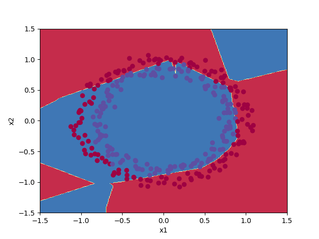

# ANN Weight Initialization Strategies
# Week 1 Assignment  
# Improving Deep Neural Networks: Hyperparameter tuning, Regularization and Optimization   

#### Visualize Data
python vizualize.py  

###### The ANN will try to classify blue vs red

 
### Zero Weights Initialization 
python Runner.py zeros  

Train/Test accuracy: 0.5 / 0.5  

  

##### Decision Boundary
 

### Random Large Weights(x10) Initialization 
python Runner.py random  

Train/Test accuracy: 0.83 / 0.86  

  

##### Decision Boundary
 

### He Initialization: sqrt(2./layers_dims[l-1]).)) 
python Runner.py he  

Train/Test accuracy: 0.993 / 0.96  

  

##### Decision Boundary
 
